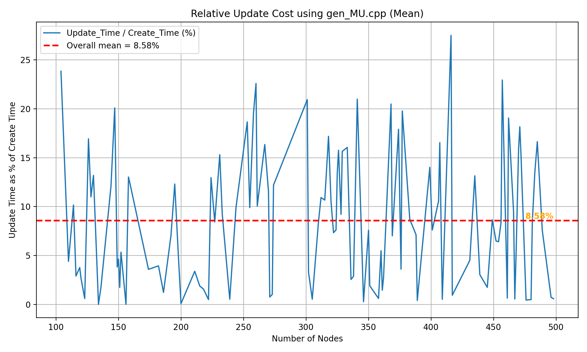
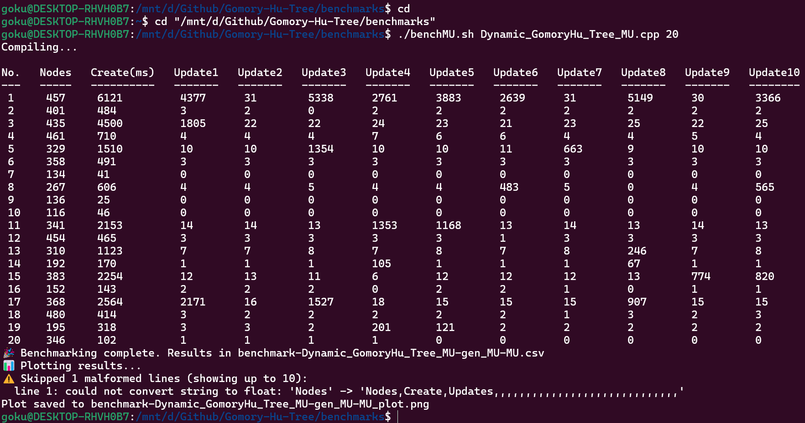

# Gomory-Hu Tree
**Muti-Terminal Network Flow** problem can be solved trivially by doing $\binom{n}{2}$ flow computations. **Gomory-Hu Tree** reduces that to $n-1$ flow computations. Thus, improving **Time Complexity** by factor of $\mathcal{O(n)}$.

A Gomory-Hu Tree (1961) is an undirected, weighted tree on the vertices of a given graph such
that each edge in the tree represents a minimum separating cut in the underlying graph
with respect to its incident vertices. 
**Property:**
1. Min-Cut between two vertices on the tree also corresponds to a Min-Cut between those vertices in the underlyng graph.
2. Min-Cut value between two vertices is equal cheapeast tree edge on the unique path
between the vertices (Corollary to 1).

**Dynamic Gomory-Hu Tree** (Tanja Hartmann and Dorothea Wagner, 2013) aims to <u>re-use</u> previously computed cuts to prevent complete re-construction of the whole tree when an edge-weights changes in the underlying graph. This, further improves the Execution Time for a dynamic graph.
  

## How to Run (Scripts)
- Use Ubuntu/Linux/WSL Terminal.
- **Argument 1** is compulsory and path is relative to "Implementation/" directory.
- Paths to [brute.cpp] and [gen.cpp] are relative to "Implementation/Test/" directory.
- Default for [number_of_iterations = 100] [brute = brute.cpp] [gen = gen.cpp].
- Keep same input and output format for <code.cpp> [brute.cpp] and use that for Testcase generator.
- [**Benchmarks**](https://github.com/soham-c04/Gomory-Hu-Tree/tree/main/benchmarks) - `./bench.sh <code.cpp> [number_of_iterations] [brute.cpp] [gen.cpp]`
    - Output is appended to "benchmark-\<code\>-\<brute\>-\<gen\>.csv".
    - If all iterations are done then Choose (y/n) for logarithmic plotting of that .csv file.
    - Use [Plotter.py](https://github.com/soham-c04/Gomory-Hu-Tree/blob/main/benchmarks/Plotter.py) to plot (takes relative path to .csv file as input).
- [**Stress Test**](https://github.com/soham-c04/Gomory-Hu-Tree/tree/main/Stress%20Test) - `./bash.sh <code.cpp> [brute.cpp] [gen.cpp]`
    - Any Testcase for which output of both codes is different is printed.
    - **Ctrl+C** to stop script.
  

## Performance
### Static Gomory-Hu Tree

### Dynamic Gomory-Hu Tree
<table align="center">
  <tr>
    <td align="center">
       
      <b>Single Update</b>
    </td>
    <td align="center">
       
      <b>Multiple Updates</b>
    </td>
  </tr>
</table>
  

## Implementation
- [**My Report**](https://github.com/soham-c04/Gomory-Hu-Tree/blob/main/Report/Report.pdf)
- [Static_GomoryHu_Tree.cpp](https://github.com/soham-c04/Gomory-Hu-Tree/blob/main/Implementation/Static_GomoryHu_Tree.cpp) Based on [Very Simple Methods for All Pairs Network Flow Analysis](https://github.com/soham-c04/Gomory-Hu-Tree/blob/main/Research%20Papers/1990%20-%20gusfield.Gomory-Hu%20Tree.pdf) ([Website](https://epubs.siam.org/doi/10.1137/0219009)).
- [Equivalent_Flow_Tree_gusfield.cpp](https://github.com/soham-c04/Gomory-Hu-Tree/blob/main/Implementation/Equivalent_Flow_Tree_gusfield.cpp) Based on [Very Simple Methods for All Pairs Network Flow Analysis](https://github.com/soham-c04/Gomory-Hu-Tree/blob/main/Research%20Papers/1990%20-%20gusfield.Gomory-Hu%20Tree.pdf) ([Website](https://epubs.siam.org/doi/10.1137/0219009)).
- [Dynamic_GomoryHu_Tree.cpp](https://github.com/soham-c04/Gomory-Hu-Tree/blob/main/Implementation/Dynamic_GomoryHu_Tree.cpp) Based on [Dynamic Gomory-Hu Tree Construction -- fast and simple](https://github.com/soham-c04/Gomory-Hu-Tree/blob/main/Research%20Papers/2013%20-%20Dynamic%20Gomory-Hu%20Tree%20construction%20-%20fast%20and%20simple%20-%20B.pdf) ([Website](https://arxiv.org/abs/1310.0178)).
  

## Test Codes
- [Dinic.cpp](https://github.com/soham-c04/Gomory-Hu-Tree/blob/main/Implementation/Dinic.cpp) - Algorithm used to compute maxflow (treated as a blackbox).
- [brute.cpp](https://github.com/soham-c04/Gomory-Hu-Tree/blob/main/Implementation/Test/brute.cpp) - Runs maxflow algorithm for each $\binom{n}{2}$ pairs of vertices.
- [reusing_Static_GomoryHu_Tree.cpp](https://github.com/soham-c04/Gomory-Hu-Tree/blob/main/Implementation/Test/reusing_Static_GomoryHu_Tree.cpp) - Reconstructs Gomory-Hu Tree from scratch for each edge update. 
- [gen.cpp](https://github.com/soham-c04/Gomory-Hu-Tree/blob/main/Implementation/Test/gen.cpp) - Generates Testcases (Random Graphs) for Static and SingleUpdate Dynamic Gomory-Hu Tree.
- **Multiple Updates:**
    - Testing Dynamic Gomory-Hu Tree against Multiple Updates per Graph.
    - [benchMU.sh](https://github.com/soham-c04/Gomory-Hu-Tree/blob/main/benchmarks/benchMU.sh) - `./benchMU.sh [code.cpp] [number_of_iterations] [gen.cpp]`
    - [Dynamic_GomoryHu_Tree_MU.cpp](https://github.com/soham-c04/Gomory-Hu-Tree/blob/main/Implementation/Test/Dynamic_GomoryHu_Tree_MU.cpp) - Prints the time requried for Each Update.
    - [gen_MU.cpp](https://github.com/soham-c04/Gomory-Hu-Tree/blob/main/Implementation/Test/gen_MU.cpp) - Generates Random Graph with Multiple Update Testcases.
    - [PlotterMU.py](https://github.com/soham-c04/Gomory-Hu-Tree/blob/main/benchmarks/Plotter.py) - Plots mean and max. %age of time required for each subsequent update w.r.t Initial Tree construction time. 
- **Example:** 