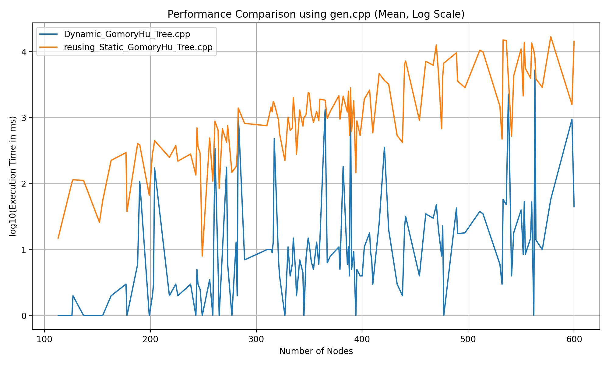

# Gomory-Hu Tree
**Muti-Terminal Network Flow** problem can be solved trivially by doing $\binom{n}{2}$ flow computations. **Gomory-Hu Tree** reduces that to $n-1$ flow computations. Thus, improving **Time Complexity** by factor of $\mathcal{O(n)}$.

A Gomory-Hu Tree (1961) is an undirected, weighted tree on the vertices of a given graph such
that each edge in the tree represents a minimum separating cut in the underlying graph
with respect to its incident vertices. 
**Property:**
1. Min-Cut between two vertices on the tree also corresponds to a Min-Cut between those vertices in the underlyng graph.
2. Min-Cut value between two vertices is equal cheapeast tree edge on the unique path
between the vertices (Corollary to 1).

**Dynamic Gomory-Hu Tree** (Tanja Hartmann and Dorothea Wagner, 2013) aims to <u>re-use</u> previously computed cuts to prevent complete re-construction of the whole tree when an edge-weights changes in the underlying graph. This, further improves the Execution Time for a dynamic graph.
  

## Benchmarks

**How to Run:**
- UbuntuLinux/WSL Terminal - `./bench.sh <code.cpp> [number_of_iterations] [brute.cpp] [gen.cpp]`
- **Argument 1** is compulsory and assumes that .cpp is in directory "Implementation". Otherwise, write path as "../\<path from root\>".
- Default for [number_of_iterations = 100] [brute = brute.cpp] [gen = gen.cpp].
- **Argument 3,4** paths are relative to "Implementation/Test/" directory.
- Output is appended to "benchmark-<code.cpp>-<brute.cpp>-<gen.cpp>.csv" in the format "<number_of_nodes>,<code(ms)>,<brute(ms)>"
- If all iterations are done then Choose (y/n) for logarithmic plotting of that .csv file.
- Use [Plotter.py](https://github.com/soham-c04/Gomory-Hu-Tree/blob/main/benchmarks/Plotter.py) to plot (takes relative path to .csv file as input).

### Static Gomory-Hu Tree

### Dynamic Gomory-Hu Tree

  

**Important Assumption:** Taking a different graph each time and doing a Single Update is Statistically same as Taking the same graph and running multiple queries on it.

  

## Stress Test
**How to Use:**
- Keep same input and output format for both files.
- Write testcase generator in `gen.cpp` as per input format.
- Run on Ubuntu/Linux/WSL terminal - `./bash.sh <code.cpp> [brute.cpp] [gen.cpp]`
- Any Testcase for which output of both codes is different is printed.
- **Ctrl+C** to stop script.

## Implementation 
- [**Static_GomoryHu_Tree.cpp:**](https://github.com/soham-c04/Gomory-Hu-Tree/blob/main/Implementation/Static_GomoryHu_Tree.cpp) Based on [Very Simple Methods for All Pairs Network Flow Analysis](https://github.com/soham-c04/Gomory-Hu-Tree/blob/main/Research%20Papers/1990%20-%20gusfield%2EGomory-Hu%20Tree) ([Website](https://epubs.siam.org/doi/10.1137/0219009)).
- [**Equivalent_Flow_Tree_gusfield.cpp**](https://github.com/soham-c04/Gomory-Hu-Tree/blob/main/Implementation/Equivalent_Flow_Tree_gusfield.cpp) Based on [Very Simple Methods for All Pairs Network Flow Analysis](https://github.com/soham-c04/Gomory-Hu-Tree/blob/main/Research%20Papers/1990%20-%20gusfield%2EGomory-Hu%20Tree) ([Website](https://epubs.siam.org/doi/10.1137/0219009)).
- [**Dynamic_GomoryHu_Tree.cpp:**](https://github.com/soham-c04/Gomory-Hu-Tree/blob/main/Implementation/Dynamic_GomoryHu_Tree.cpp) Based on [Dynamic Gomory-Hu Tree Construction -- fast and simple](https://github.com/soham-c04/Gomory-Hu-Tree/blob/main/Research%20Papers/2013%20-%20Dynamic%20Gomory-Hu%20Tree%20construction%20-%20fast%20and%20simple%20-%20B) ([Website](https://arxiv.org/abs/1310.0178)).